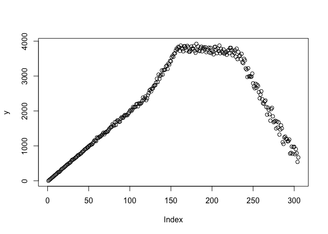
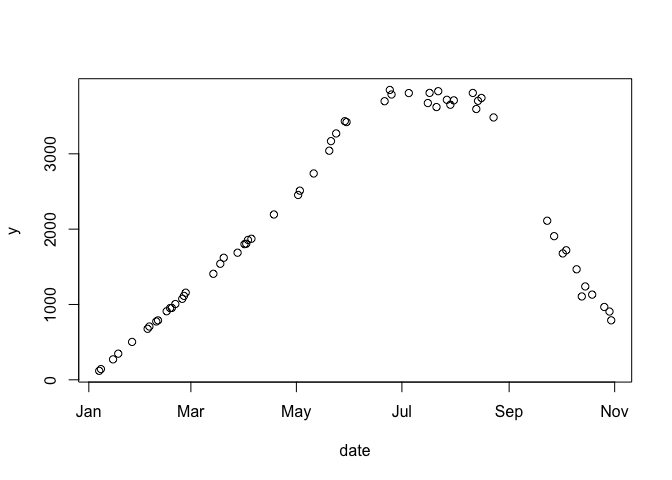
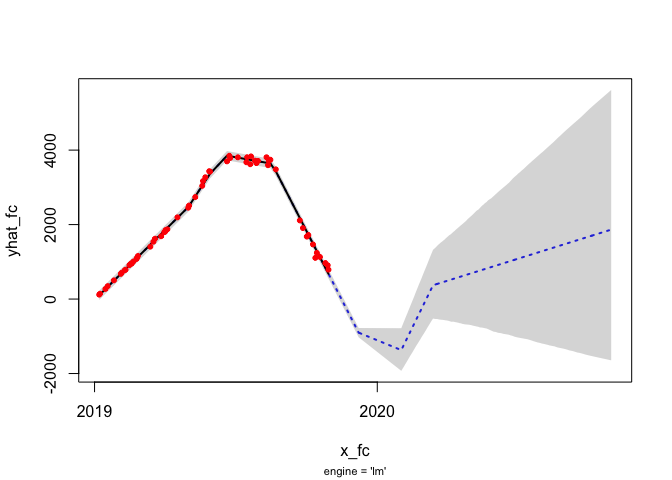

<!-- README.md is generated from README.Rmd. Please edit that file -->

# slopeflex

The goal of `slopeflex` is to estimate change points (slope flexes) for
a vector of daily time series data including any future not-yet-observed
slope flexes/changes/shifts.

Both instances require a prior on what the slope flex/shift/change is
going to be. When data are available for a given point, the model
estimates the change accordingly. When data are not available, the model
will forecast accordingly using the provided prior.

This package is useful when dates anytime dates for existing change
points (slope flexes) are known. It is likewise informative for modeling
future change points.

## Installation

You can install the development version of slopeflex from Github:

``` r
install.packages('remotes')
remotes::install_github("dantonnoriega/slopeflex")
```

## Example

Here is an example of how slopeflex works using simulated data.

``` r
######################################
## SLOPEFLEX ----------------
######################################
library(slopeflex)
#> slopeflex 0.0.0.9002
library(tidyverse)
#> ── Attaching packages ─────────────────────────────────────────────────────────────────────────────────────────────────────────────────────────────────────────────────────────────── tidyverse 1.3.1 ──
#> ✓ ggplot2 3.3.5     ✓ purrr   0.3.4
#> ✓ tibble  3.1.3     ✓ dplyr   1.0.7
#> ✓ tidyr   1.1.3     ✓ stringr 1.4.0
#> ✓ readr   2.0.0     ✓ forcats 0.5.1
#> ── Conflicts ────────────────────────────────────────────────────────────────────────────────────────────────────────────────────────────────────────────────────────────────── tidyverse_conflicts() ──
#> x dplyr::filter() masks stats::filter()
#> x dplyr::lag()    masks stats::lag()
set.seed(2020)
dates <- seq(as.Date('2019-01-01'), as.Date('2019-11-01'), by = 'day')
# create 4 segments (3 breaks/flexes)
n <- length(dates) # length of original data 274
slope <- rnorm(4, 5, 40)
slope_sd <- .3
breaks <- dates[c(1, 121, 159, 230)]
# generate the data
y0 <- pmax(0, dates - breaks[1]) * rnorm(n, slope[1], slope_sd)
y1 <- pmax(0, dates - breaks[2]) * rnorm(n, slope[2], slope_sd)
y2 <- pmax(0, dates - breaks[3]) * rnorm(n, slope[3], slope_sd)
y3 <- pmax(0, dates - breaks[4]) * rnorm(n, slope[4], slope_sd)
y <- y0 + y1 + y2 + y3
plot(y)
```



``` r
# want to build a dataset that maps each point to a date then takes only a sample
ds <- tibble::tibble(date = dates, y = y) # expects "date" and "y"
ds <- ds %>%
  dplyr::sample_n(60) %>%
  dplyr::arrange(date)
# plot the redux ds dataframe
with(ds, plot(y = y, x = date))
```



``` r
# build a list of existing AND future slope flexes (sx)
## add some uncertainty to the break points
sx <- tibble::tribble(
  ~date, ~params, ~params_sd,
  # these dates comprise the dates we sort of know with our best guesses
  # on the slope changes
  breaks[2] + round(rnorm(1, 2, 3)), 5, 1,
  breaks[3] + round(rnorm(1, 2, 3)), 10, 10,
  breaks[4] + round(rnorm(1, 2, 3)), -20, 20,
  # these dates comprise future dates as "best guesses" by folks with
  # knowledge (e.g. engineers)
  as.Date("2019-12-08"), 32, 5,
  as.Date("2020-02-01"), 51, 3,
  as.Date("2020-03-13"), -36, 5
)
sx
#> # A tibble: 6 × 3
#>   date       params params_sd
#>   <date>      <dbl>     <dbl>
#> 1 2019-05-02      5         1
#> 2 2019-06-15     10        10
#> 3 2019-08-18    -20        20
#> 4 2019-12-08     32         5
#> 5 2020-02-01     51         3
#> 6 2020-03-13    -36         5


###############################################################################
# (0) PROTOTYPE SLOPE FLEX --------------------------------------
###############################################################################
# input dataframe ds with values (date, y) and slope flex table
# sx with horizon h
h = 365
sx_obj_stan <- slopeflex_fit_model(ds,sx,h)
#> 
#> SAMPLING FOR MODEL 'XB' NOW (CHAIN 1).
#> Chain 1: 
#> Chain 1: Gradient evaluation took 4.3e-05 seconds
#> Chain 1: 1000 transitions using 10 leapfrog steps per transition would take 0.43 seconds.
#> Chain 1: Adjust your expectations accordingly!
#> Chain 1: 
#> Chain 1: 
#> Chain 1: Iteration:    1 / 2500 [  0%]  (Warmup)
#> Chain 1: Iteration:  250 / 2500 [ 10%]  (Warmup)
#> Chain 1: Iteration:  500 / 2500 [ 20%]  (Warmup)
#> Chain 1: Iteration:  501 / 2500 [ 20%]  (Sampling)
#> Chain 1: Iteration:  750 / 2500 [ 30%]  (Sampling)
#> Chain 1: Iteration: 1000 / 2500 [ 40%]  (Sampling)
#> Chain 1: Iteration: 1250 / 2500 [ 50%]  (Sampling)
#> Chain 1: Iteration: 1500 / 2500 [ 60%]  (Sampling)
#> Chain 1: Iteration: 1750 / 2500 [ 70%]  (Sampling)
#> Chain 1: Iteration: 2000 / 2500 [ 80%]  (Sampling)
#> Chain 1: Iteration: 2250 / 2500 [ 90%]  (Sampling)
#> Chain 1: Iteration: 2500 / 2500 [100%]  (Sampling)
#> Chain 1: 
#> Chain 1:  Elapsed Time: 0.310989 seconds (Warm-up)
#> Chain 1:                0.679207 seconds (Sampling)
#> Chain 1:                0.990196 seconds (Total)
#> Chain 1:
sx_obj_lm <- slopeflex_fit_model(ds,sx,h, 'lm')

# build plot ------------------------------------------------------------------
plot(sx_obj_stan)
```


``` r
plot(sx_obj_lm)
```


